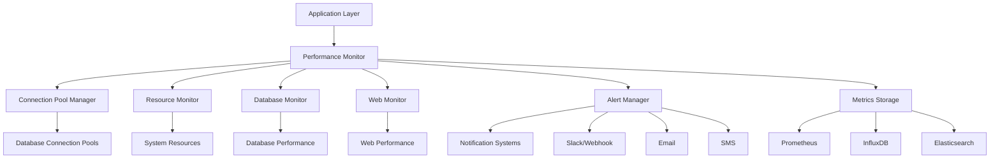

# Performance Monitoring and Profiling Implementation Guide

## Overview
The Enterprise Reporting System implements a comprehensive performance monitoring and profiling system to ensure optimal system performance, identify bottlenecks, and maintain high availability. This document details the monitoring architecture, tools, and integration guidelines.

## Architecture Overview

### Performance Monitoring Stack
The system employs a layered monitoring approach:



### Core Components

#### Performance Monitor
Central monitoring orchestrator that manages all performance monitoring components:

- **Resource Monitoring**: CPU, memory, disk, network usage
- **Database Monitoring**: Connection pools, query performance, slow queries
- **Web Monitoring**: HTTP request/response times, throughput
- **Application Monitoring**: Function execution times, memory usage
- **Alert Management**: Performance threshold alerts and notifications
- **Metrics Collection**: System and application metrics collection
- **Data Storage**: Performance metrics storage and retrieval
- **Profiling**: Code execution profiling and optimization

#### Connection Pool Manager
Advanced database connection pooling for optimal database performance:

- **Connection Pooling**: Efficient database connection management
- **Pool Monitoring**: Real-time pool status and metrics
- **Connection Lifecycle**: Connection creation, reuse, and cleanup
- **Performance Optimization**: Pool sizing and tuning
- **Error Handling**: Connection failures and retries
- **Security**: Secure connection management
- **High Availability**: Failover and redundancy

#### Resource Monitor
System resource monitoring with comprehensive metrics:

- **CPU Monitoring**: CPU usage, load averages, process scheduling
- **Memory Monitoring**: RAM usage, swap usage, memory pressure
- **Disk Monitoring**: Disk I/O, space usage, filesystem health
- **Network Monitoring**: Bandwidth usage, packet loss, latency
- **Process Monitoring**: Process counts, thread counts, resource usage
- **System Health**: Overall system health and stability

#### Database Monitor
Database performance monitoring and optimization:

- **Query Performance**: SQL query execution times and efficiency
- **Connection Pooling**: Pool utilization and performance
- **Slow Query Detection**: Identification of problematic queries
- **Index Usage**: Index effectiveness and optimization
- **Transaction Monitoring**: Transaction performance and locking
- **Replication Monitoring**: Database replication status and lag
- **Storage Optimization**: Disk usage and optimization

#### Web Monitor
Web application performance monitoring:

- **HTTP Metrics**: Request rates, response times, error rates
- **API Performance**: REST API endpoint performance
- **WebSocket Monitoring**: Real-time connection performance
- **Static Asset Delivery**: CDN and asset delivery performance
- **User Experience**: Page load times and user interactions
- **Security Monitoring**: Security-related performance impacts
- **Third-Party Integration**: External service performance

## Performance Monitoring Features

### Real-Time Monitoring
Continuous real-time performance monitoring:

```python
# Real-Time Monitoring Configuration
real_time_monitoring_config = {
    "enable_real_time_monitoring": True,
    "monitoring_frequency_seconds": {
        "system_resources": 10,      # Every 10 seconds
        "database_performance": 30,   # Every 30 seconds
        "web_performance": 15,        # Every 15 seconds
        "application_metrics": 5,      # Every 5 seconds
        "alert_conditions": 30        # Every 30 seconds
    },
    "enable_continuous_profiling": True,
    "profiling_sample_rate": 0.01,   # 1% sampling rate
    "enable_live_metrics": True,
    "live_metrics_refresh_rate_ms": 1000,  # 1 second refresh
    "enable_real_time_alerts": True,
    "real_time_alert_check_interval_ms": 5000,  # 5 second checks
    "enable_streaming_metrics": True,
    "streaming_metrics_batch_size": 100,
    "streaming_metrics_flush_interval_ms": 1000
}
```

### Historical Analysis
Long-term performance trend analysis:

```python
# Historical Analysis Configuration
historical_analysis_config = {
    "enable_historical_analysis": True,
    "data_retention_days": 90,
    "enable_trend_analysis": True,
    "trend_analysis_window_days": 30,
    "enable_baseline_calculation": True,
    "baseline_calculation_window_days": 7,
    "enable_anomaly_detection": True,
    "anomaly_detection_sensitivity": 0.95,  # 95% confidence
    "enable_capacity_planning": True,
    "capacity_planning_horizon_months": 12,
    "enable_performance_forecasting": True,
    "forecasting_model": "prophet",  # prophet, arima, lstm
    "forecasting_accuracy_threshold": 0.90  # 90% accuracy target
}
```

### Performance Profiling
Detailed code execution profiling:

```python
# Performance Profiling Configuration
profiling_config = {
    "enable_profiling": True,
    "profiling_methods": {
        "function_profiling": True,
        "line_profiling": True,
        "memory_profiling": True,
        "cpu_profiling": True,
        "io_profiling": True,
        "database_profiling": True,
        "web_profiling": True,
        "async_profiling": True
    },
    "profiling_output_formats": {
        "enable_json_output": True,
        "enable_csv_output": True,
        "enable_html_output": True,
        "enable_pdf_output": True,
        "enable_graphviz_output": True
    },
    "profiling_storage": {
        "enable_profiling_storage": True,
        "storage_location": "database",  # database, file_system, s3
        "storage_retention_days": 30,
        "enable_profiling_compression": True,
        "profiling_compression_algorithm": "gzip"
    },
    "profiling_scheduling": {
        "enable_scheduled_profiling": True,
        "scheduled_profiling_intervals": {
            "daily": "0 2 * * *",      # Daily at 2 AM
            "weekly": "0 3 * * 0",     # Weekly on Sunday at 3 AM
            "monthly": "0 4 1 * *"     # Monthly on 1st at 4 AM
        },
        "enable_on_demand_profiling": True,
        "on_demand_trigger_thresholds": {
            "high_cpu_usage": 80,      # Profile when CPU > 80%
            "high_memory_usage": 85,   # Profile when memory > 85%
            "slow_response_time": 5000 # Profile when response > 5s
        }
    }
}
```

## Metrics Collection and Storage

### Metrics Categories
Comprehensive metrics collection across multiple categories:

```python
# Metrics Collection Configuration
metrics_config = {
    "enable_metrics_collection": True,
    "metrics_categories": {
        "system_metrics": {
            "enable_collection": True,
            "collection_interval_seconds": 10,
            "metrics": {
                "cpu_usage_percent": True,
                "memory_usage_percent": True,
                "disk_usage_percent": True,
                "network_bandwidth_bytes": True,
                "process_count": True,
                "thread_count": True,
                "load_average": True,
                "context_switches": True,
                "interrupts": True,
                "system_uptime_seconds": True
            }
        },
        "database_metrics": {
            "enable_collection": True,
            "collection_interval_seconds": 30,
            "metrics": {
                "connection_pool_usage": True,
                "query_execution_time_ms": True,
                "slow_query_count": True,
                "transaction_count": True,
                "deadlock_count": True,
                "lock_wait_time_ms": True,
                "buffer_cache_hit_ratio": True,
                "disk_io_operations": True
            }
        },
        "web_metrics": {
            "enable_collection": True,
            "collection_interval_seconds": 15,
            "metrics": {
                "http_request_count": True,
                "http_response_time_ms": True,
                "http_error_rate_percent": True,
                "active_connections": True,
                "websocket_connections": True,
                "api_endpoint_response_times": True,
                "static_asset_delivery_time_ms": True,
                "user_session_count": True
            }
        },
        "application_metrics": {
            "enable_collection": True,
            "collection_interval_seconds": 5,
            "metrics": {
                "function_execution_time_ms": True,
                "memory_allocation_mb": True,
                "garbage_collection_count": True,
                "event_loop_latency_ms": True,
                "queue_depth": True,
                "worker_process_count": True,
                "task_completion_rate": True,
                "exception_count": True
            }
        }
    },
    "metrics_storage": {
        "enable_multiple_backends": True,
        "primary_backend": "prometheus",
        "secondary_backends": ["influxdb", "elasticsearch"],
        "enable_local_cache": True,
        "local_cache_size": 10000,
        "enable_metrics_compression": True,
        "metrics_compression_algorithm": "gzip",
        "enable_metrics_aggregation": True,
        "metrics_aggregation_intervals": {
            "1m": 60,    # 1 minute aggregation
            "5m": 300,   # 5 minute aggregation
            "15m": 900,  # 15 minute aggregation
            "1h": 3600   # 1 hour aggregation
        }
    }
}
```

### Prometheus Integration
Native Prometheus metrics export:

```python
# Prometheus Integration Configuration
prometheus_config = {
    "enable_prometheus_export": True,
    "prometheus_port": 9091,
    "prometheus_endpoint": "/metrics",
    "enable_custom_metrics": True,
    "custom_metrics_namespace": "reports_system",
    "custom_metrics_prefix": "reports",
    "enable_histogram_metrics": True,
    "histogram_buckets": [0.005, 0.01, 0.025, 0.05, 0.1, 0.25, 0.5, 1.0, 2.5, 5.0, 10.0],
    "enable_summary_metrics": True,
    "summary_quantiles": {
        "0.5": 0.05,   # 50th percentile with 5% error
        "0.9": 0.01,   # 90th percentile with 1% error
        "0.95": 0.005, # 95th percentile with 0.5% error
        "0.99": 0.001  # 99th percentile with 0.1% error
    },
    "enable_counter_metrics": True,
    "enable_gauge_metrics": True,
    "enable_info_metrics": True,
    "info_metric_labels": {
        "version": "1.0.0",
        "commit": "abc123def456",
        "build_date": "2023-01-01",
        "environment": "production"
    }
}
```

### InfluxDB Integration
Time-series database integration:

```python
# InfluxDB Integration Configuration
influxdb_config = {
    "enable_influxdb_export": True,
    "influxdb_url": "http://localhost:8086",
    "influxdb_token": "YOUR_INFLUXDB_TOKEN",
    "influxdb_org": "reports-org",
    "influxdb_bucket": "reports-metrics",
    "enable_batch_writes": True,
    "batch_write_size": 1000,
    "batch_write_interval_ms": 5000,
    "enable_retention_policies": True,
    "retention_policy_duration": "90d",  # 90 days
    "enable_continuous_queries": True,
    "continuous_queries": {
        "daily_aggregates": {
            "query": "SELECT mean(*) INTO daily_metrics FROM metrics GROUP BY time(1d)",
            "schedule": "0 0 * * *"
        },
        "hourly_aggregates": {
            "query": "SELECT mean(*) INTO hourly_metrics FROM metrics GROUP BY time(1h)",
            "schedule": "0 * * * *"
        }
    }
}
```

## Alerting and Notification

### Alert Policies
Intelligent alerting with comprehensive policies:

```python
# Alert Policy Configuration
alert_policy_config = {
    "enable_alerting": True,
    "alert_policies": {
        "system_resource_alerts": {
            "cpu_usage_high": {
                "enabled": True,
                "metric": "system_cpu_usage_percent",
                "threshold": 85,
                "comparison": "greater_than",
                "duration_seconds": 300,  # 5 minutes
                "severity": "warning",
                "cooldown_seconds": 1800,  # 30 minutes
                "notification_channels": ["slack", "email"],
                "enable_escalation": True,
                "escalation_policy": {
                    "level_1": {
                        "recipients": ["ops_team"],
                        "timeout_minutes": 15
                    },
                    "level_2": {
                        "recipients": ["senior_ops"],
                        "timeout_minutes": 30
                    },
                    "level_3": {
                        "recipients": ["management"],
                        "timeout_minutes": 60
                    }
                }
            },
            "memory_usage_critical": {
                "enabled": True,
                "metric": "system_memory_usage_percent",
                "threshold": 95,
                "comparison": "greater_than",
                "duration_seconds": 120,  # 2 minutes
                "severity": "critical",
                "cooldown_seconds": 900,   # 15 minutes
                "notification_channels": ["pagerduty", "slack", "sms"],
                "enable_escalation": True,
                "escalation_policy": {
                    "level_1": {
                        "recipients": ["ops_team"],
                        "timeout_minutes": 5
                    },
                    "level_2": {
                        "recipients": ["senior_ops", "management"],
                        "timeout_minutes": 15
                    }
                }
            },
            "disk_space_low": {
                "enabled": True,
                "metric": "system_disk_usage_percent",
                "threshold": 90,
                "comparison": "greater_than",
                "duration_seconds": 600,   # 10 minutes
                "severity": "warning",
                "cooldown_seconds": 3600,  # 1 hour
                "notification_channels": ["email"],
                "enable_escalation": False
            }
        },
        "database_performance_alerts": {
            "slow_query_threshold_exceeded": {
                "enabled": True,
                "metric": "database_slow_query_count",
                "threshold": 10,
                "comparison": "greater_than",
                "duration_seconds": 300,   # 5 minutes
                "severity": "warning",
                "cooldown_seconds": 1800,  # 30 minutes
                "notification_channels": ["slack", "email"],
                "enable_escalation": True,
                "escalation_policy": {
                    "level_1": {
                        "recipients": ["db_team"],
                        "timeout_minutes": 30
                    },
                    "level_2": {
                        "recipients": ["senior_db", "ops_team"],
                        "timeout_minutes": 60
                    }
                }
            },
            "connection_pool_exhausted": {
                "enabled": True,
                "metric": "database_connection_pool_usage_percent",
                "threshold": 95,
                "comparison": "greater_than",
                "duration_seconds": 60,    # 1 minute
                "severity": "critical",
                "cooldown_seconds": 600,   # 10 minutes
                "notification_channels": ["pagerduty", "slack", "sms"],
                "enable_escalation": True,
                "escalation_policy": {
                    "level_1": {
                        "recipients": ["db_team"],
                        "timeout_minutes": 5
                    },
                    "level_2": {
                        "recipients": ["senior_db", "ops_team", "management"],
                        "timeout_minutes": 15
                    }
                }
            }
        },
        "web_performance_alerts": {
            "high_response_time": {
                "enabled": True,
                "metric": "web_response_time_ms",
                "threshold": 5000,  # 5 seconds
                "comparison": "greater_than",
                "duration_seconds": 300,   # 5 minutes
                "severity": "warning",
                "cooldown_seconds": 1800,  # 30 minutes
                "notification_channels": ["slack", "email"],
                "enable_escalation": False
            },
            "high_error_rate": {
                "enabled": True,
                "metric": "web_error_rate_percent",
                "threshold": 5,  # 5% error rate
                "comparison": "greater_than",
                "duration_seconds": 300,   # 5 minutes
                "severity": "warning",
                "cooldown_seconds": 1800,  # 30 minutes
                "notification_channels": ["slack", "email"],
                "enable_escalation": False
            }
        }
    },
    "alert_suppression": {
        "enable_alert_suppression": True,
        "suppression_rules": {
            "maintenance_windows": True,
            "related_alerts": True,
            "noise_reduction": True
        },
        "suppression_window_seconds": 300  # 5 minutes
    },
    "alert_correlation": {
        "enable_alert_correlation": True,
        "correlation_window_seconds": 600,  # 10 minutes
        "correlation_rules": {
            "causal_relationships": True,
            "common_root_causes": True,
            "temporal_patterns": True
        }
    }
}
```

### Notification Channels
Multiple notification channel support:

```python
# Notification Channel Configuration
notification_config = {
    "enable_notifications": True,
    "notification_channels": {
        "slack": {
            "enabled": True,
            "webhook_urls": {
                "alerts": "https://hooks.slack.com/services/YOUR/SLACK/WEBHOOK",
                "performance": "https://hooks.slack.com/services/YOUR/SLACK/PERFORMANCE",
                "operations": "https://hooks.slack.com/services/YOUR/SLACK/OPERATIONS"
            },
            "channel_mappings": {
                "critical": "#alerts-critical",
                "high": "#alerts-high",
                "medium": "#alerts-medium",
                "low": "#alerts-low"
            },
            "enable_message_formatting": True,
            "message_templates": {
                "alert": "🚨 *{severity}* alert: {message}\nHost: {hostname}\nTime: {timestamp}",
                "resolution": "✅ *RESOLVED*: {message}\nHost: {hostname}\nResolved: {timestamp}",
                "performance": "📊 Performance update: {message}\nMetric: {metric}\nValue: {value}"
            }
        },
        "email": {
            "enabled": True,
            "smtp_server": "smtp.example.com",
            "smtp_port": 587,
            "smtp_username": "alerts@example.com",
            "smtp_password": "YOUR_SMTP_PASSWORD",
            "enable_tls": True,
            "sender_email": "alerts@example.com",
            "recipient_groups": {
                "ops_team": ["ops@example.com", "admin@example.com"],
                "db_team": ["dba@example.com"],
                "management": ["manager@example.com"]
            },
            "email_templates": {
                "alert": {
                    "subject": "[{severity}] {message}",
                    "body": "Alert Details:\n\nSeverity: {severity}\nMessage: {message}\nHost: {hostname}\nTime: {timestamp}\n\n{additional_details}"
                },
                "performance": {
                    "subject": "[PERFORMANCE] {message}",
                    "body": "Performance Alert:\n\nMessage: {message}\nMetric: {metric}\nValue: {value}\nTime: {timestamp}"
                }
            }
        },
        "pagerduty": {
            "enabled": True,
            "integration_key": "YOUR_PAGERDUTY_INTEGRATION_KEY",
            "enable_detailed_alerts": True,
            "detailed_alert_template": {
                "service_key": "{integration_key}",
                "incident_key": "{alert_id}",
                "event_type": "trigger",
                "description": "{message}",
                "client": "Enterprise Reporting System",
                "client_url": "http://reports.example.com",
                "details": {
                    "severity": "{severity}",
                    "hostname": "{hostname}",
                    "timestamp": "{timestamp}",
                    "metric": "{metric}",
                    "value": "{value}",
                    "threshold": "{threshold}"
                }
            }
        },
        "webhook": {
            "enabled": True,
            "webhook_urls": [
                "https://webhook.example.com/alerts",
                "https://webhook.example.com/performance"
            ],
            "webhook_headers": {
                "Content-Type": "application/json",
                "User-Agent": "EnterpriseReportingSystem/1.0"
            },
            "webhook_timeout_seconds": 30,
            "enable_webhook_signing": True,
            "webhook_signing_secret": "YOUR_WEBHOOK_SIGNING_SECRET"
        }
    }
}
```

## Performance Optimization

### Connection Pool Optimization
Advanced database connection pool tuning:

```python
# Connection Pool Optimization Configuration
pool_optimization_config = {
    "enable_pool_optimization": True,
    "pool_sizing": {
        "min_pool_size": 5,
        "max_pool_size": 20,
        "pool_overflow_size": 10,
        "pool_timeout_seconds": 30,
        "pool_recycle_seconds": 3600,  # 1 hour
        "pool_pre_ping": True,
        "enable_adaptive_pool_sizing": True,
        "adaptive_sizing_algorithm": "moving_average",  # moving_average, exponential_smoothing
        "adaptive_sizing_window_minutes": 15,
        "adaptive_sizing_threshold_percent": 80
    },
    "connection_lifecycle": {
        "enable_connection_validation": True,
        "connection_validation_query": "SELECT 1",
        "connection_validation_timeout_seconds": 5,
        "enable_connection_reset": True,
        "connection_reset_query": "ROLLBACK",
        "enable_connection_preparation": True,
        "connection_preparation_queries": [
            "SET application_name = 'enterprise_reporting'",
            "SET statement_timeout = 30000"  # 30 seconds
        ]
    },
    "pool_monitoring": {
        "enable_pool_monitoring": True,
        "pool_monitoring_interval_seconds": 60,
        "pool_metrics": {
            "pool_size": True,
            "pool_available": True,
            "pool_checked_out": True,
            "pool_overflow": True,
            "pool_wait_time_ms": True,
            "pool_checkout_time_ms": True,
            "pool_checkin_time_ms": True,
            "pool_connection_errors": True,
            "pool_timeout_errors": True
        }
    }
}
```

### Query Optimization
Database query performance optimization:

```python
# Query Optimization Configuration
query_optimization_config = {
    "enable_query_optimization": True,
    "slow_query_detection": {
        "enable_detection": True,
        "slow_query_threshold_ms": 1000,  # 1 second
        "slow_query_sampling_rate": 0.1,   # 10% sampling
        "enable_query_plan_analysis": True,
        "query_plan_analysis_threshold_ms": 500,  # 500ms
        "enable_explain_analyze": True,
        "explain_analyze_sampling_rate": 0.01  # 1% sampling
    },
    "query_caching": {
        "enable_query_caching": True,
        "query_cache_size": 1000,
        "query_cache_ttl_seconds": 300,  # 5 minutes
        "enable_query_cache_warming": True,
        "query_cache_warming_queries": [
            "SELECT * FROM reports WHERE timestamp > NOW() - INTERVAL '1 hour'",
            "SELECT hostname, COUNT(*) FROM reports GROUP BY hostname"
        ],
        "enable_adaptive_caching": True,
        "adaptive_caching_algorithm": "lru",  # lru, lfu, fifo
        "adaptive_caching_threshold_hits": 10
    },
    "index_recommendations": {
        "enable_index_recommendations": True,
        "index_recommendation_algorithm": "cost_based",  # cost_based, usage_based, hybrid
        "index_recommendation_sampling_rate": 0.05,  # 5% sampling
        "enable_index_recommendation_storage": True,
        "index_recommendation_storage_format": "json",  # json, csv, database
        "index_recommendation_retention_days": 30
    },
    "query_analysis": {
        "enable_query_analysis": True,
        "query_analysis_interval_seconds": 300,  # 5 minutes
        "enable_query_pattern_analysis": True,
        "query_pattern_analysis_window_hours": 24,
        "enable_query_complexity_analysis": True,
        "query_complexity_threshold": 5,  # Complexity score threshold
        "enable_query_duplicate_detection": True,
        "query_duplicate_detection_threshold": 0.95  # 95% similarity threshold
    }
}
```

### Memory Optimization
Application memory usage optimization:

```python
# Memory Optimization Configuration
memory_optimization_config = {
    "enable_memory_optimization": True,
    "garbage_collection": {
        "enable_gc_tuning": True,
        "gc_generation_threshold": [700, 10, 10],
        "enable_gc_monitoring": True,
        "gc_monitoring_interval_seconds": 60,
        "enable_gc_profiling": True,
        "gc_profiling_sampling_rate": 0.01,  # 1% sampling
        "enable_gc_cleanup": True,
        "gc_cleanup_interval_seconds": 300,  # 5 minutes
        "enable_gc_manual_trigger": True,
        "gc_manual_trigger_threshold_mb": 100  # Trigger GC when memory usage > 100MB
    },
    "object_pooling": {
        "enable_object_pooling": True,
        "pooled_object_types": [
            "database_connections",
            "http_sessions",
            "file_handles",
            "network_sockets"
        ],
        "object_pool_size": {
            "database_connections": 50,
            "http_sessions": 1000,
            "file_handles": 100,
            "network_sockets": 200
        },
        "enable_object_pool_monitoring": True,
        "object_pool_monitoring_interval_seconds": 30
    },
    "memory_profiling": {
        "enable_memory_profiling": True,
        "memory_profiling_interval_seconds": 300,  # 5 minutes
        "enable_memory_leak_detection": True,
        "memory_leak_detection_threshold_mb": 10,  # 10MB growth threshold
        "memory_leak_detection_window_minutes": 60,  # 1 hour window
        "enable_memory_usage_alerts": True,
        "memory_usage_alert_threshold_percent": 85,  # 85% memory usage
        "enable_memory_dump_generation": True,
        "memory_dump_generation_threshold_mb": 500,  # Generate dump when > 500MB
        "memory_dump_storage_location": "/tmp/memory_dumps"
    }
}
```

## Performance Testing and Benchmarking

### Load Testing Framework
Automated performance testing capabilities:

```python
# Load Testing Configuration
load_testing_config = {
    "enable_load_testing": True,
    "load_test_scenarios": {
        "basic_queries": {
            "description": "Basic query performance test",
            "test_queries": [
                "SELECT * FROM system_info WHERE hostname = 'test-server'",
                "SELECT COUNT(*) FROM network_info WHERE timestamp > NOW() - INTERVAL '1 hour'",
                "SELECT * FROM filesystem_info ORDER BY timestamp DESC LIMIT 100"
            ],
            "concurrent_users": 100,
            "test_duration_seconds": 300,  # 5 minutes
            "ramp_up_time_seconds": 60,     # 1 minute
            "think_time_seconds": 1,        # 1 second between requests
            "enable_metrics_collection": True,
            "metrics_collection_interval_seconds": 10
        },
        "heavy_queries": {
            "description": "Heavy query performance test",
            "test_queries": [
                "SELECT * FROM system_info WHERE timestamp > NOW() - INTERVAL '30 days'",
                "SELECT hostname, AVG(cpu_usage_percent) FROM system_info GROUP BY hostname",
                "SELECT * FROM network_info WHERE bytes_sent > 1000000 ORDER BY timestamp DESC"
            ],
            "concurrent_users": 50,
            "test_duration_seconds": 600,   # 10 minutes
            "ramp_up_time_seconds": 120,    # 2 minutes
            "think_time_seconds": 2,        # 2 seconds between requests
            "enable_metrics_collection": True,
            "metrics_collection_interval_seconds": 30
        },
        "concurrent_writes": {
            "description": "Concurrent write performance test",
            "test_queries": [
                "INSERT INTO system_info (hostname, timestamp, data) VALUES (%s, NOW(), %s)",
                "UPDATE system_info SET data = %s WHERE hostname = %s AND timestamp > NOW() - INTERVAL '1 hour'",
                "DELETE FROM system_info WHERE timestamp < NOW() - INTERVAL '30 days'"
            ],
            "concurrent_users": 25,
            "test_duration_seconds": 180,   # 3 minutes
            "ramp_up_time_seconds": 30,     # 30 seconds
            "think_time_seconds": 0.5,      # 0.5 seconds between requests
            "enable_metrics_collection": True,
            "metrics_collection_interval_seconds": 5
        }
    },
    "load_test_metrics": {
        "enable_response_time_tracking": True,
        "response_time_percentiles": [50, 90, 95, 99],  # Percentiles to track
        "enable_throughput_tracking": True,
        "throughput_tracking_window_seconds": 10,
        "enable_error_rate_tracking": True,
        "error_rate_tracking_window_seconds": 60,
        "enable_resource_usage_tracking": True,
        "resource_usage_tracking_interval_seconds": 5,
        "enable_connection_pool_tracking": True,
        "connection_pool_tracking_interval_seconds": 10
    },
    "load_test_reporting": {
        "enable_test_reporting": True,
        "report_formats": ["html", "json", "csv", "pdf"],
        "report_storage_location": "/tmp/load_test_reports",
        "enable_report_comparison": True,
        "report_comparison_window_days": 30,
        "enable_performance_trend_analysis": True,
        "performance_trend_analysis_window_days": 90
    }
}
```

### Stress Testing Framework
System stress testing for capacity planning:

```python
# Stress Testing Configuration
stress_testing_config = {
    "enable_stress_testing": True,
    "stress_test_profiles": {
        "cpu_stress": {
            "description": "CPU stress test",
            "test_duration_seconds": 300,  # 5 minutes
            "cpu_cores_to_stress": "all",  # all or specific cores
            "stress_intensity_percent": 90, # 90% CPU utilization
            "enable_memory_pressure": True,
            "memory_pressure_mb": 1000,    # 1GB memory pressure
            "enable_disk_io_stress": True,
            "disk_io_stress_mb": 100,      # 100MB disk I/O stress
            "enable_network_stress": True,
            "network_stress_bandwidth_mbps": 100,  # 100Mbps network stress
            "enable_metrics_collection": True,
            "metrics_collection_interval_seconds": 5
        },
        "memory_stress": {
            "description": "Memory stress test",
            "test_duration_seconds": 180,  # 3 minutes
            "memory_stress_mb": 4000,      # 4GB memory stress
            "enable_cpu_pressure": True,
            "cpu_pressure_percent": 50,    # 50% CPU pressure
            "enable_disk_io_stress": True,
            "disk_io_stress_mb": 50,       # 50MB disk I/O stress
            "enable_metrics_collection": True,
            "metrics_collection_interval_seconds": 3
        },
        "disk_stress": {
            "description": "Disk I/O stress test",
            "test_duration_seconds": 240,  # 4 minutes
            "disk_stress_mb": 2000,        # 2GB disk I/O stress
            "disk_stress_pattern": "sequential",  # sequential, random, mixed
            "enable_cpu_pressure": True,
            "cpu_pressure_percent": 30,    # 30% CPU pressure
            "enable_memory_pressure": True,
            "memory_pressure_mb": 500,     # 500MB memory pressure
            "enable_metrics_collection": True,
            "metrics_collection_interval_seconds": 10
        }
    },
    "stress_test_monitoring": {
        "enable_system_monitoring": True,
        "system_monitoring_interval_seconds": 1,
        "enable_application_monitoring": True,
        "application_monitoring_interval_seconds": 2,
        "enable_database_monitoring": True,
        "database_monitoring_interval_seconds": 5,
        "enable_network_monitoring": True,
        "network_monitoring_interval_seconds": 3,
        "enable_alerting": True,
        "alerting_thresholds": {
            "cpu_usage_percent": 95,
            "memory_usage_percent": 90,
            "disk_usage_percent": 95,
            "response_time_ms": 5000,
            "error_rate_percent": 10
        }
    },
    "stress_test_reporting": {
        "enable_stress_test_reporting": True,
        "report_formats": ["html", "json", "csv"],
        "report_storage_location": "/tmp/stress_test_reports",
        "enable_performance_degradation_analysis": True,
        "performance_degradation_threshold_percent": 20,  # 20% performance degradation
        "enable_failure_analysis": True,
        "failure_analysis_depth": "detailed"  # basic, moderate, detailed
    }
}
```

## Monitoring and Dashboards

### Grafana Integration
Grafana dashboard configuration for performance monitoring:

```python
# Grafana Integration Configuration
grafana_config = {
    "enable_grafana_integration": True,
    "grafana_url": "http://localhost:3000",
    "grafana_api_key": "YOUR_GRAFANA_API_KEY",
    "enable_dashboard_provisioning": True,
    "dashboard_provisioning_path": "/var/lib/grafana/dashboards",
    "dashboard_templates": {
        "system_performance": {
            "name": "System Performance Dashboard",
            "description": "Comprehensive system performance monitoring",
            "tags": ["performance", "system", "monitoring"],
            "enable_alerts": True,
            "alert_channels": ["slack", "email"]
        },
        "database_performance": {
            "name": "Database Performance Dashboard",
            "description": "Database performance and query monitoring",
            "tags": ["performance", "database", "monitoring"],
            "enable_alerts": True,
            "alert_channels": ["slack", "pagerduty"]
        },
        "web_performance": {
            "name": "Web Performance Dashboard",
            "description": "Web application performance monitoring",
            "tags": ["performance", "web", "monitoring"],
            "enable_alerts": True,
            "alert_channels": ["slack", "email"]
        },
        "application_performance": {
            "name": "Application Performance Dashboard",
            "description": "Application-level performance monitoring",
            "tags": ["performance", "application", "monitoring"],
            "enable_alerts": True,
            "alert_channels": ["slack", "email"]
        }
    },
    "grafana_datasources": {
        "prometheus": {
            "name": "Prometheus",
            "type": "prometheus",
            "url": "http://localhost:9090",
            "access": "proxy",
            "enable_basic_auth": False
        },
        "influxdb": {
            "name": "InfluxDB",
            "type": "influxdb",
            "url": "http://localhost:8086",
            "access": "proxy",
            "database": "reports-metrics",
            "enable_basic_auth": True,
            "basic_auth_user": "admin",
            "basic_auth_password": "admin_password"
        }
    }
}
```

### Alert Dashboard
Web-based alert management dashboard:

```python
# Alert Dashboard Configuration
alert_dashboard_config = {
    "enable_alert_dashboard": True,
    "dashboard_port": 8082,
    "dashboard_host": "0.0.0.0",
    "enable_authentication": True,
    "authentication_method": "session",  # session, basic_auth, oauth2, saml
    "enable_authorization": True,
    "authorization_roles": {
        "admin": ["view_alerts", "manage_alerts", "configure_alerts"],
        "operator": ["view_alerts", "acknowledge_alerts"],
        "viewer": ["view_alerts"]
    },
    "alert_dashboard_features": {
        "enable_alert_filtering": True,
        "alert_filter_options": ["severity", "status", "category", "time_range"],
        "enable_alert_grouping": True,
        "alert_grouping_options": ["severity", "category", "hostname"],
        "enable_alert_silencing": True,
        "alert_silencing_options": ["time_based", "pattern_based"],
        "enable_alert_correlation": True,
        "alert_correlation_window_minutes": 60,
        "enable_alert_export": True,
        "alert_export_formats": ["csv", "json", "pdf"],
        "enable_alert_history": True,
        "alert_history_retention_days": 90,
        "enable_alert_timeline": True,
        "alert_timeline_resolution": "minute"  # minute, hour, day
    },
    "dashboard_ui": {
        "enable_dark_mode": True,
        "theme": "dark",  # dark, light, auto
        "enable_responsive_design": True,
        "enable_mobile_optimization": True,
        "enable_keyboard_shortcuts": True,
        "keyboard_shortcuts": {
            "acknowledge_alert": "a",
            "silence_alert": "s",
            "refresh_dashboard": "r",
            "toggle_filters": "f",
            "toggle_timeline": "t"
        },
        "enable_visualizations": True,
        "visualization_types": ["bar_chart", "line_chart", "pie_chart", "heat_map"],
        "enable_notifications": True,
        "notification_position": "top_right",  # top_right, bottom_right, toast
        "notification_duration_seconds": 5
    }
}
```

## Best Practices

### Performance Optimization Best Practices
1. **Connection Pool Sizing**: Size pools appropriately for your workload
2. **Query Optimization**: Use indexes and optimize slow queries
3. **Memory Management**: Monitor and optimize memory usage
4. **Caching Strategy**: Implement multi-level caching for optimal performance
5. **Resource Monitoring**: Continuously monitor system resources
6. **Load Testing**: Regular load testing to identify bottlenecks
7. **Performance Profiling**: Profile code to identify performance issues
8. **Database Optimization**: Optimize database configuration and queries

### Security Best Practices
1. **Secure Connections**: Use SSL/TLS for all database connections
2. **Access Control**: Implement proper RBAC and permissions
3. **Credential Security**: Store credentials securely with encryption
4. **Audit Logging**: Comprehensive logging of all database operations
5. **Network Security**: Use private networks and firewalls
6. **Data Encryption**: Encrypt sensitive data at rest and in transit
7. **Regular Updates**: Keep database software up to date
8. **Vulnerability Scanning**: Regular security scanning of database systems

### Monitoring Best Practices
1. **Comprehensive Metrics**: Collect metrics from all system components
2. **Real-Time Monitoring**: Implement real-time monitoring and alerting
3. **Historical Analysis**: Store historical data for trend analysis
4. **Dashboard Visualization**: Create intuitive dashboards for monitoring
5. **Alerting Strategy**: Implement intelligent alerting with proper thresholds
6. **Performance Baselines**: Establish performance baselines for comparison
7. **Capacity Planning**: Use metrics for capacity planning and scaling
8. **Incident Response**: Implement incident response procedures

### Troubleshooting Best Practices
1. **Log Management**: Centralized logging with proper log levels
2. **Error Tracking**: Comprehensive error tracking and analysis
3. **Debugging Tools**: Use appropriate debugging and profiling tools
4. **Performance Profiling**: Regular performance profiling and optimization
5. **Root Cause Analysis**: Systematic root cause analysis for issues
6. **Knowledge Base**: Maintain knowledge base of common issues and solutions
7. **Documentation**: Keep comprehensive documentation for troubleshooting
8. **Training**: Regular training for team members on troubleshooting

This comprehensive database connection pooling implementation provides enterprise-grade performance optimization and monitoring capabilities for the Enterprise Reporting System.