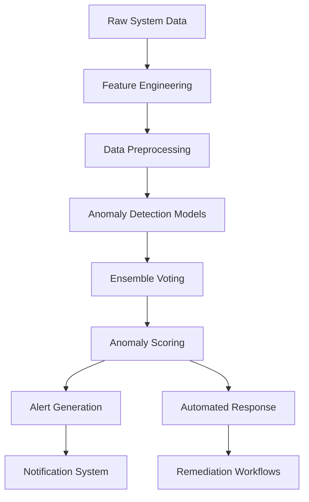

# ML-Based Anomaly Detection Implementation Guide

## Overview
The Enterprise Reporting System implements sophisticated ML-based anomaly detection to identify unusual patterns, potential security threats, and system performance issues. This document details the anomaly detection architecture, algorithms, and integration guidelines.

## Architecture Overview

### Multi-Layer Detection Strategy
The system employs a comprehensive multi-layer anomaly detection approach:

1. **Statistical Anomaly Detection**: Traditional statistical methods for baseline detection
2. **Machine Learning Anomaly Detection**: Advanced ML models for complex pattern recognition
3. **Rule-Based Anomaly Detection**: Business logic-based anomaly identification
4. **Ensemble Detection**: Combined approach leveraging multiple detection methods
5. **Real-Time Streaming Detection**: Continuous monitoring of live data streams

### Detection Pipeline
The anomaly detection pipeline follows these stages:



## Core Components

### Feature Engineering
Advanced feature extraction and engineering for optimal detection:

```python
# Feature Engineering Configuration
feature_engineering_config = {
    "enable_time_series_features": True,
    "time_series_features": {
        "rolling_statistics": {
            "windows": [5, 10, 30, 60],  # Minutes
            "statistics": ["mean", "std", "min", "max", "median"]
        },
        "trend_analysis": {
            "enable_linear_trend": True,
            "enable_polynomial_trend": True,
            "polynomial_degree": 2
        },
        "seasonal_decomposition": {
            "enable_seasonal": True,
            "seasonal_periods": [24, 168]  # Hourly and weekly patterns
        }
    },
    "cross_feature_interactions": {
        "enable_correlations": True,
        "enable_ratios": True,
        "enable_differences": True,
        "max_interaction_depth": 3
    },
    "statistical_features": {
        "enable_z_scores": True,
        "enable_percentiles": True,
        "percentile_levels": [5, 25, 50, 75, 95],
        "enable_outlier_detection": True,
        "outlier_methods": ["iqr", "z_score", "modified_z_score"]
    },
    "domain_specific_features": {
        "enable_system_metrics": True,
        "enable_network_metrics": True,
        "enable_security_indicators": True,
        "enable_business_metrics": True
    }
}
```

### Model Architecture
Support for multiple ML algorithms with ensemble voting:

```python
# Model Architecture Configuration
model_architecture_config = {
    "primary_models": {
        "isolation_forest": {
            "enabled": True,
            "contamination": 0.1,
            "n_estimators": 100,
            "max_samples": "auto",
            "bootstrap": False
        },
        "one_class_svm": {
            "enabled": True,
            "nu": 0.1,
            "kernel": "rbf",
            "gamma": "scale"
        },
        "local_outlier_factor": {
            "enabled": True,
            "n_neighbors": 20,
            "contamination": 0.1,
            "novelty": True
        },
        "autoencoder": {
            "enabled": True,
            "hidden_layers": [64, 32, 16, 32, 64],
            "epochs": 100,
            "batch_size": 32,
            "learning_rate": 0.001
        }
    },
    "ensemble_configuration": {
        "enable_ensemble": True,
        "voting_strategy": "weighted_average",  # majority_vote, weighted_average, confidence_weighted
        "model_weights": {
            "isolation_forest": 0.3,
            "one_class_svm": 0.3,
            "local_outlier_factor": 0.2,
            "autoencoder": 0.2
        },
        "threshold_aggregation": "mean",  # mean, median, max, min
        "enable_dynamic_weighting": True,
        "dynamic_weighting_window": 3600  # 1 hour window
    },
    "online_learning": {
        "enable_online_learning": True,
        "learning_rate": 0.01,
        "batch_update_size": 1000,
        "enable_incremental_learning": True,
        "incremental_update_frequency": 300  # 5 minutes
    }
}
```

## Detection Algorithms

### Statistical Methods
Traditional statistical approaches for baseline anomaly detection:

#### Isolation Forest
- **Strengths**: Excellent for high-dimensional data, fast training
- **Weaknesses**: Less interpretable, sensitive to contamination parameter
- **Use Cases**: System metrics, network traffic analysis

```python
# Isolation Forest Configuration
isolation_forest_config = {
    "algorithm_parameters": {
        "n_estimators": 100,
        "max_samples": "auto",
        "contamination": 0.1,
        "max_features": 1.0,
        "bootstrap": False,
        "n_jobs": -1,
        "behaviour": "new",
        "random_state": 42
    },
    "optimization": {
        "enable_hyperparameter_tuning": True,
        "hyperparameter_grid": {
            "n_estimators": [50, 100, 200],
            "max_samples": [0.5, 0.75, "auto"],
            "contamination": [0.05, 0.1, 0.15]
        },
        "cross_validation_folds": 5,
        "scoring_metric": "roc_auc"
    }
}
```

#### One-Class SVM
- **Strengths**: Effective for complex decision boundaries, good theoretical foundation
- **Weaknesses**: Computationally expensive, sensitive to kernel choice
- **Use Cases**: Security intrusion detection, complex pattern recognition

```python
# One-Class SVM Configuration
one_class_svm_config = {
    "algorithm_parameters": {
        "kernel": "rbf",
        "nu": 0.1,
        "gamma": "scale",
        "tol": 0.001,
        "shrinking": True,
        "cache_size": 200
    },
    "kernel_options": {
        "linear": {"C": 1.0},
        "rbf": {"gamma": "scale"},
        "poly": {"degree": 3, "coef0": 0.0},
        "sigmoid": {"coef0": 0.0}
    }
}
```

### Deep Learning Methods
Neural network approaches for complex anomaly detection:

#### Autoencoders
- **Strengths**: Excellent for complex, high-dimensional data, learns representations
- **Weaknesses**: Requires large datasets, computationally intensive
- **Use Cases**: Image-based anomaly detection, complex temporal patterns

```python
# Autoencoder Configuration
autoencoder_config = {
    "network_architecture": {
        "input_dim": 50,
        "hidden_layers": [64, 32, 16, 32, 64],
        "activation": "relu",
        "output_activation": "linear",
        "dropout_rate": 0.2
    },
    "training_parameters": {
        "epochs": 100,
        "batch_size": 32,
        "learning_rate": 0.001,
        "optimizer": "adam",
        "loss_function": "mse",
        "validation_split": 0.2,
        "early_stopping_patience": 10
    },
    "anomaly_detection": {
        "reconstruction_error_threshold": 0.1,
        "enable_dynamic_threshold": True,
        "dynamic_threshold_percentile": 95
    }
}
```

### Ensemble Methods
Combination of multiple algorithms for robust detection:

```python
# Ensemble Configuration
ensemble_config = {
    "voting_strategies": {
        "majority_voting": {
            "enabled": True,
            "threshold": 0.5  # 50% of models must agree
        },
        "weighted_voting": {
            "enabled": True,
            "weights": {
                "isolation_forest": 0.3,
                "one_class_svm": 0.3,
                "local_outlier_factor": 0.2,
                "autoencoder": 0.2
            }
        },
        "stacking": {
            "enabled": True,
            "meta_classifier": "logistic_regression",
            "cross_validation_folds": 5
        }
    },
    "model_diversity": {
        "enable_diversity_promotion": True,
        "diversity_metrics": ["kappa", "disagreement", "double_fault"],
        "diversity_threshold": 0.3
    }
}
```

## Real-Time Detection

### Streaming Architecture
Real-time anomaly detection for live data streams:

```python
# Streaming Detection Configuration
streaming_config = {
    "enable_streaming_detection": True,
    "stream_buffer_size": 10000,
    "processing_window_size": 1000,
    "sliding_window_overlap": 0.5,
    "enable_micro_batching": True,
    "micro_batch_size": 100,
    "micro_batch_interval_ms": 1000,
    "enable_watermarking": True,
    "watermark_delay_ms": 5000,
    "enable_checkpointing": True,
    "checkpoint_interval_ms": 30000
}
```

### Online Learning
Continuous model updates with new data:

```python
# Online Learning Configuration
online_learning_config = {
    "enable_online_learning": True,
    "learning_rate": 0.01,
    "forgetting_factor": 0.99,
    "concept_drift_detection": {
        "enable_detection": True,
        "drift_detection_method": "adwin",  # adwin, ddm, eddm
        "warning_level": 0.01,
        "drift_level": 0.05
    },
    "model_update_frequency": {
        "batch_updates": 1000,  # After 1000 new samples
        "time_based_updates": 3600  # Every hour
    },
    "enable_incremental_updates": True,
    "incremental_update_batch_size": 100
}
```

## Feature Engineering Pipeline

### Time Series Features
Advanced temporal feature extraction:

```python
# Time Series Feature Engineering
time_series_features = {
    "trend_analysis": {
        "enable_linear_trend": True,
        "enable_polynomial_trend": True,
        "polynomial_degree": 2,
        "enable_exponential_trend": True,
        "trend_window_sizes": [10, 30, 60, 120]  # Minutes
    },
    "seasonal_analysis": {
        "enable_seasonal_decomposition": True,
        "seasonal_periods": [24, 168, 8760],  # Hourly, weekly, yearly
        "enable_fourier_terms": True,
        "fourier_terms": 5
    },
    "change_point_detection": {
        "enable_change_point_detection": True,
        "change_point_methods": ["pelt", "binseg", "bottomup"],
        "penalty": "bic"
    },
    "volatility_features": {
        "enable_volatility_calculation": True,
        "volatility_windows": [5, 15, 30, 60],
        "volatility_methods": ["rolling_std", "ewm_std", "arch_model"]
    }
}
```

### Statistical Features
Comprehensive statistical feature extraction:

```python
# Statistical Feature Engineering
statistical_features = {
    "distribution_features": {
        "enable_moments": True,
        "moments_order": [1, 2, 3, 4],  # Mean, Variance, Skewness, Kurtosis
        "enable_quantiles": True,
        "quantile_levels": [0.05, 0.25, 0.5, 0.75, 0.95],
        "enable_tail_statistics": True,
        "tail_threshold": 0.95
    },
    "correlation_features": {
        "enable_pairwise_correlations": True,
        "correlation_methods": ["pearson", "spearman", "kendall"],
        "enable_cross_correlations": True,
        "cross_correlation_lags": [1, 5, 10, 30]
    },
    "entropy_features": {
        "enable_entropy_calculation": True,
        "entropy_bins": 10,
        "entropy_methods": ["shannon", "renyi", "tsallis"]
    }
}
```

## Model Management

### Model Training Pipeline
Automated model training and validation:

```python
# Model Training Configuration
training_config = {
    "data_preparation": {
        "enable_data_cleaning": True,
        "missing_value_strategy": "impute",  # drop, impute, interpolate
        "outlier_handling": "winsorize",  # remove, winsorize, transform
        "feature_scaling": "standard",  # standard, minmax, robust, none
        "enable_feature_selection": True,
        "feature_selection_method": "mutual_information"
    },
    "model_training": {
        "enable_cross_validation": True,
        "cv_folds": 5,
        "enable_hyperparameter_tuning": True,
        "hyperparameter_search_method": "random_search",  # grid_search, bayesian_optimization
        "hyperparameter_trials": 50,
        "enable_early_stopping": True,
        "early_stopping_patience": 10
    },
    "model_validation": {
        "validation_metrics": ["precision", "recall", "f1_score", "auc_roc", "auc_pr"],
        "enable_bootstrap_validation": True,
        "bootstrap_samples": 1000,
        "enable_confidence_intervals": True,
        "confidence_level": 0.95
    }
}
```

### Model Persistence
Robust model storage and versioning:

```python
# Model Persistence Configuration
persistence_config = {
    "enable_model_saving": True,
    "model_storage_format": "joblib",  # joblib, pickle, onnx, tf_saved_model
    "enable_model_versioning": True,
    "max_model_versions": 10,
    "model_retention_days": 90,
    "enable_model_compression": True,
    "compression_method": "gzip",
    "enable_model_encryption": True,
    "encryption_method": "AES-256"
}
```

## Anomaly Scoring and Classification

### Scoring Mechanisms
Multiple scoring approaches for accurate anomaly detection:

```python
# Anomaly Scoring Configuration
scoring_config = {
    "scoring_methods": {
        "distance_based": {
            "enabled": True,
            "methods": ["mahalanobis", "euclidean", "manhattan"],
            "normalization": "minmax"
        },
        "density_based": {
            "enabled": True,
            "methods": ["local_outlier_factor", "kde_density"],
            "bandwidth_estimation": "silverman"
        },
        "reconstruction_based": {
            "enabled": True,
            "error_metrics": ["mse", "mae", "rmse"],
            "threshold_methods": ["percentile", "iqr", "gaussian"]
        }
    },
    "score_normalization": {
        "enable_normalization": True,
        "normalization_method": "z_score",  # z_score, minmax, robust
        "enable_calibration": True,
        "calibration_method": "platt_scaling",  # platt_scaling, isotonic_regression
    },
    "confidence_estimation": {
        "enable_confidence_scoring": True,
        "confidence_methods": ["model_uncertainty", "ensemble_variance", "neighborhood_similarity"],
        "uncertainty_quantification": "monte_carlo_dropout"  # monte_carlo_dropout, ensemble_diversity
    }
}
```

### Severity Classification
Multi-level severity classification for prioritization:

```python
# Severity Classification Configuration
severity_config = {
    "severity_levels": {
        "critical": {
            "threshold": 0.9,
            "priority": 1,
            "response_required": "immediate",
            "notification_channels": ["pager", "slack", "email"]
        },
        "high": {
            "threshold": 0.7,
            "priority": 2,
            "response_required": "within_15_minutes",
            "notification_channels": ["slack", "email"]
        },
        "medium": {
            "threshold": 0.5,
            "priority": 3,
            "response_required": "within_1_hour",
            "notification_channels": ["email"]
        },
        "low": {
            "threshold": 0.3,
            "priority": 4,
            "response_required": "within_24_hours",
            "notification_channels": ["dashboard"]
        }
    },
    "dynamic_severity_adjustment": {
        "enable_dynamic_adjustment": True,
        "adjustment_factors": {
            "business_impact": 1.5,
            "time_of_day": 2.0,  # Higher during business hours
            "user_activity": 1.2,  # Higher when users are active
            "system_criticality": 2.0  # Higher for critical systems
        }
    }
}
```

## Alerting and Notification

### Alert Management
Intelligent alert management to prevent alert fatigue:

```python
# Alert Management Configuration
alert_management_config = {
    "alert_suppression": {
        "enable_suppression": True,
        "suppression_window": 300,  # 5 minutes
        "suppression_rules": {
            "same_host_same_type": True,
            "related_anomalies": True,
            "noise_reduction": True
        }
    },
    "alert_correlation": {
        "enable_correlation": True,
        "correlation_window": 600,  # 10 minutes
        "correlation_rules": {
            "causal_relationships": True,
            "common_root_cause": True,
            "temporal_patterns": True
        }
    },
    "notification_routing": {
        "enable_smart_routing": True,
        "routing_rules": {
            "critical_alerts": ["ops_team", "management"],
            "high_alerts": ["ops_team"],
            "medium_alerts": ["support_team"],
            "low_alerts": ["dashboard"]
        },
        "notification_channels": {
            "pager": {
                "enabled": True,
                "provider": "pagerduty",
                "escalation_policy": "standard"
            },
            "slack": {
                "enabled": True,
                "channels": {
                    "critical": "#alerts-critical",
                    "high": "#alerts-high",
                    "medium": "#alerts-medium",
                    "low": "#alerts-low"
                }
            },
            "email": {
                "enabled": True,
                "templates": {
                    "critical": "critical_alert_template.html",
                    "high": "high_alert_template.html",
                    "medium": "medium_alert_template.html",
                    "low": "low_alert_template.html"
                }
            }
        }
    }
}
```

### Alert Content Generation
Rich alert content with contextual information:

```python
# Alert Content Configuration
alert_content_config = {
    "alert_templates": {
        "enable_rich_alerts": True,
        "template_variables": {
            "anomaly_details": True,
            "historical_context": True,
            "recommended_actions": True,
            "impact_assessment": True,
            "remediation_guidance": True
        },
        "enable_visualizations": True,
        "visualization_types": ["timeseries_chart", "distribution_plot", "correlation_matrix"],
        "enable_runbooks": True,
        "runbook_integration": "confluence"  # confluence, wiki, internal_docs
    },
    "multilingual_support": {
        "enable_multilingual": True,
        "supported_languages": ["en", "es", "fr", "de", "ja"],
        "translation_service": "google_translate"  # google_translate, deepl, custom
    }
}
```

## Performance Optimization

### Computational Efficiency
Optimization strategies for high-performance anomaly detection:

```python
# Performance Optimization Configuration
performance_config = {
    "parallelization": {
        "enable_parallel_processing": True,
        "max_concurrent_workers": 8,
        "task_partitioning_strategy": "dynamic",  # dynamic, static, guided
        "enable_gpu_acceleration": True,
        "gpu_device": "cuda:0"
    },
    "memory_optimization": {
        "enable_memory_profiling": True,
        "memory_limit_mb": 4096,
        "enable_chunked_processing": True,
        "chunk_size": 10000,
        "enable_sparse_matrices": True
    },
    "caching_strategies": {
        "enable_feature_caching": True,
        "feature_cache_ttl": 3600,  # 1 hour
        "enable_prediction_caching": True,
        "prediction_cache_ttl": 1800,  # 30 minutes
        "cache_eviction_policy": "lru"  # lru, fifo, lfu
    }
}
```

### Model Optimization
Optimization techniques for efficient model execution:

```python
# Model Optimization Configuration
model_optimization_config = {
    "model_compression": {
        "enable_pruning": True,
        "pruning_method": "magnitude_based",
        "pruning_ratio": 0.3,
        "enable_quantization": True,
        "quantization_bits": 8,
        "enable_distillation": True,
        "teacher_student_ratio": 0.7
    },
    "inference_optimization": {
        "enable_model_compilation": True,
        "compilation_target": "tensorrt",  # tensorrt, onnx_runtime, openvino
        "enable_batch_inference": True,
        "batch_size": 32,
        "enable_model_serving": True,
        "serving_framework": "tensorflow_serving"  # tensorflow_serving, torchserve, seldon
    }
}
```

## Monitoring and Observability

### Model Monitoring
Continuous monitoring of model performance and health:

```python
# Model Monitoring Configuration
monitoring_config = {
    "model_performance_monitoring": {
        "enable_performance_tracking": True,
        "performance_metrics": ["accuracy", "precision", "recall", "f1_score", "auc_roc"],
        "monitoring_frequency": 300,  # 5 minutes
        "enable_drift_detection": True,
        "drift_detection_methods": ["ks_test", "psi", "csi"],
        "drift_alerting": True,
        "drift_alert_threshold": 0.1
    },
    "data_quality_monitoring": {
        "enable_data_quality_checks": True,
        "quality_metrics": ["missing_values", "duplicate_records", "outliers", "distribution_shift"],
        "quality_thresholds": {
            "missing_values": 0.05,  # 5% threshold
            "duplicate_records": 0.01,  # 1% threshold
            "outliers": 0.02  # 2% threshold
        }
    },
    "model_explainability": {
        "enable_explainability": True,
        "explainability_methods": ["shap", "lime", "feature_importance"],
        "enable_automated_explanations": True,
        "explanation_cache_ttl": 86400  # 24 hours
    }
}
```

### System Monitoring
Comprehensive system monitoring for anomaly detection infrastructure:

```python
# System Monitoring Configuration
system_monitoring_config = {
    "infrastructure_monitoring": {
        "enable_infrastructure_monitoring": True,
        "monitored_resources": ["cpu", "memory", "disk", "network", "gpu"],
        "monitoring_intervals": {
            "cpu": 60,  # 1 minute
            "memory": 60,
            "disk": 300,  # 5 minutes
            "network": 60,
            "gpu": 120  # 2 minutes
        }
    },
    "service_health_monitoring": {
        "enable_service_monitoring": True,
        "health_check_endpoints": ["/health", "/ready", "/live"],
        "health_check_intervals": 30,  # 30 seconds
        "enable_circuit_breaker": True,
        "failure_threshold": 5,
        "recovery_timeout": 300  # 5 minutes
    },
    "observability_integration": {
        "enable_prometheus_metrics": True,
        "prometheus_endpoint": "/metrics",
        "enable_logging": True,
        "log_level": "INFO",
        "enable_tracing": True,
        "tracing_provider": "jaeger",  # jaeger, zipkin, datadog
        "sampling_rate": 0.1  # 10% sampling
    }
}
```

## Integration Patterns

### Data Integration
Seamless integration with various data sources:

```python
# Data Integration Configuration
data_integration_config = {
    "data_sources": {
        "enable_database_integration": True,
        "databases": ["postgresql", "mysql", "mongodb"],
        "enable_streaming_integration": True,
        "streaming_platforms": ["kafka", "rabbitmq", "redis_streams"],
        "enable_file_integration": True,
        "file_formats": ["csv", "json", "parquet", "avro"]
    },
    "data_ingestion": {
        "enable_batch_processing": True,
        "batch_processing_schedule": "*/5 * * * *",  # Every 5 minutes
        "enable_streaming_processing": True,
        "streaming_buffer_size": 1000,
        "enable_change_data_capture": True,
        "cdc_providers": ["debezium", "maxwell", "dms"]
    },
    "data_quality": {
        "enable_data_validation": True,
        "validation_rules": {
            "schema_validation": True,
            "range_validation": True,
            "consistency_validation": True,
            "integrity_validation": True
        }
    }
}
```

### Alert Integration
Integration with various alerting and monitoring systems:

```python
# Alert Integration Configuration
alert_integration_config = {
    "incident_management": {
        "enable_incident_creation": True,
        "incident_management_systems": ["jira", "servicenow", "pagerduty"],
        "auto_assignment": True,
        "assignment_rules": {
            "by_severity": True,
            "by_service": True,
            "by_team": True
        }
    },
    "notification_channels": {
        "enable_multi_channel_notification": True,
        "notification_providers": {
            "email": {
                "enabled": True,
                "smtp_server": "smtp.example.com",
                "port": 587,
                "encryption": "tls"
            },
            "slack": {
                "enabled": True,
                "webhook_urls": {
                    "alerts": "YOUR_SLACK_WEBHOOK_URL",
                    "incidents": "YOUR_SLACK_WEBHOOK_URL"
                }
            },
            "pagerduty": {
                "enabled": True,
                "integration_keys": {
                    "critical": "XXXXXXXXXXXXXXXXXXXXXXXXXXXXXXXX",
                    "high": "YYYYYYYYYYYYYYYYYYYYYYYYYYYYYYYY"
                }
            }
        }
    },
    "collaboration_tools": {
        "enable_collaboration_integration": True,
        "collaboration_platforms": ["slack", "microsoft_teams", "zoom"],
        "enable_automated_meetings": True,
        "meeting_templates": {
            "critical_incident": "incident_response_template",
            "major_incident": "major_incident_template"
        }
    }
}
```

## Security and Compliance

### Data Security
Comprehensive security measures for anomaly detection:

```python
# Security Configuration
security_config = {
    "data_encryption": {
        "enable_data_encryption": True,
        "encryption_at_rest": True,
        "encryption_in_transit": True,
        "encryption_algorithm": "AES-256-GCM",
        "key_management": "aws_kms"  # aws_kms, azure_key_vault, hashicorp_vault
    },
    "access_control": {
        "enable_rbac": True,
        "roles": {
            "admin": ["read", "write", "delete", "admin"],
            "analyst": ["read", "write"],
            "viewer": ["read"]
        },
        "enable_attribute_based_access": True,
        "attributes": ["department", "location", "clearance_level"]
    },
    "audit_logging": {
        "enable_audit_logging": True,
        "log_level": "INFO",
        "log_retention_days": 365,
        "enable_immutable_logging": True,
        "immutable_log_destination": "s3_bucket"  # s3_bucket, cloudwatch, elasticsearch
    }
}
```

### Compliance Features
Compliance support for various regulatory frameworks:

```python
# Compliance Configuration
compliance_config = {
    "regulatory_compliance": {
        "enable_gdpr_compliance": True,
        "enable_hipaa_compliance": True,
        "enable_sox_compliance": True,
        "enable_iso27001_compliance": True
    },
    "data_governance": {
        "enable_data_lineage": True,
        "enable_data_catalog": True,
        "enable_data_classification": True,
        "classification_levels": ["public", "internal", "confidential", "restricted"]
    },
    "privacy_controls": {
        "enable_privacy_by_design": True,
        "enable_data_minimization": True,
        "enable_right_to_erasure": True,
        "enable_right_to_access": True,
        "enable_consent_management": True
    }
}
```

## Deployment and Operations

### Production Deployment
Production-ready deployment configuration:

```python
# Production Deployment Configuration
production_config = {
    "high_availability": {
        "enable_high_availability": True,
        "replica_count": 3,
        "load_balancing_strategy": "round_robin",  # round_robin, least_connections, ip_hash
        "enable_auto_scaling": True,
        "auto_scaling_metrics": ["cpu_utilization", "memory_utilization", "request_latency"],
        "auto_scaling_thresholds": {
            "cpu_utilization": 0.7,
            "memory_utilization": 0.8,
            "request_latency": 0.5  # seconds
        }
    },
    "disaster_recovery": {
        "enable_disaster_recovery": True,
        "backup_frequency": "daily",
        "backup_retention_days": 30,
        "disaster_recovery_plan": "active_passive",  # active_passive, active_active, multi_region
        "recovery_time_objective": 300,  # 5 minutes
        "recovery_point_objective": 3600  # 1 hour
    },
    "monitoring_and_alerting": {
        "enable_infrastructure_monitoring": True,
        "infrastructure_monitoring_tools": ["prometheus", "grafana", "alertmanager"],
        "enable_business_monitoring": True,
        "business_monitoring_tools": ["datadog", "newrelic", "splunk"],
        "enable_security_monitoring": True,
        "security_monitoring_tools": ["splunk", "elastic", "qradar"]
    }
}
```

### Containerization and Orchestration
Containerized deployment with Kubernetes orchestration:

```python
# Containerization Configuration
containerization_config = {
    "docker_configuration": {
        "base_image": "python:3.11-slim",
        "container_registry": "harbor.example.com",
        "image_tagging_strategy": "semantic_versioning",  # semantic_versioning, git_sha, timestamp
        "enable_multi_stage_build": True,
        "multi_stage_build_stages": ["builder", "runtime"]
    },
    "kubernetes_deployment": {
        "enable_kubernetes_deployment": True,
        "deployment_strategy": "rolling_update",  # rolling_update, blue_green, canary
        "resource_limits": {
            "requests": {
                "cpu": "500m",
                "memory": "1Gi"
            },
            "limits": {
                "cpu": "1000m",
                "memory": "2Gi"
            }
        },
        "enable_horizontal_pod_autoscaler": True,
        "hpa_metrics": ["cpu", "memory", "custom_metrics"],
        "hpa_targets": {
            "cpu": 70,
            "memory": 80,
            "custom_metrics": {
                "anomaly_detection_rate": 50  # anomalies per minute
            }
        }
    }
}
```

## Best Practices

### Model Development Best Practices
1. **Start Simple**: Begin with basic statistical methods before moving to complex ML models
2. **Feature Engineering**: Invest time in quality feature engineering rather than complex models
3. **Validation**: Use proper cross-validation techniques to avoid overfitting
4. **Explainability**: Ensure models are interpretable for business stakeholders
5. **Monitoring**: Continuously monitor model performance and data drift

### Production Best Practices
1. **Gradual Rollout**: Use canary deployments for new models
2. **Rollback Strategy**: Have quick rollback capability for model issues
3. **Performance Monitoring**: Monitor inference latency and resource usage
4. **Alerting**: Set up comprehensive alerting for model performance degradation
5. **Documentation**: Maintain detailed documentation for model behavior and limitations

### Security Best Practices
1. **Data Encryption**: Encrypt data at rest and in transit
2. **Access Controls**: Implement role-based access controls
3. **Audit Trails**: Maintain comprehensive audit logs
4. **Model Security**: Protect model artifacts from tampering
5. **Compliance**: Ensure compliance with relevant regulations

This comprehensive ML-based anomaly detection implementation provides enterprise-grade anomaly detection capabilities while maintaining performance, scalability, and security for the Enterprise Reporting System.